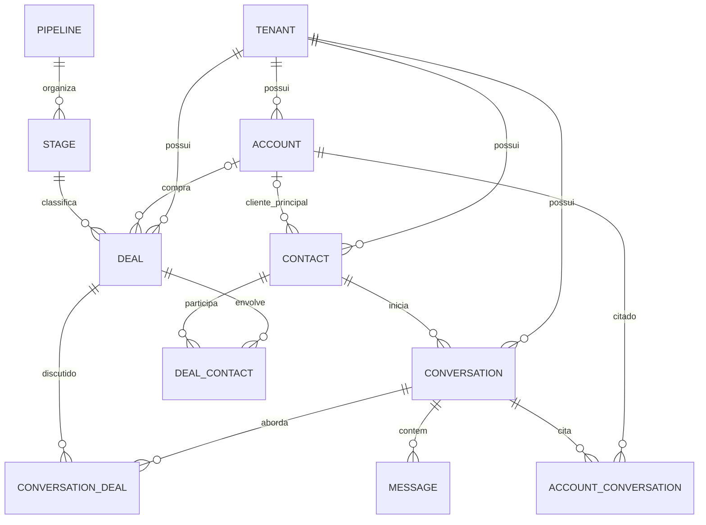

# Plano único — Conversas + CRM

**Data:** 28/09/2026. **Estado:** especificação para revisão; nenhuma tela, migração ou mudança operacional foi implementada por este plano.

Este é o documento principal para transformar o sistema de atendimento em **Conversas + CRM**. Reúne análise do sistema atual, referências do RD Station CRM, modelo de cliente/contato/conversa/negociação, desenho do Kanban e dos cards, integração entre as telas e implantação. A análise do repositório foi estática. Não houve acesso ao banco de produção nem à conta privada do RD. As oito capturas enviadas pelo usuário foram usadas como referência visual, sem copiar os dados comerciais das imagens para o repositório.

## 1. Decisões centrais do produto

| Identidade | Significado | Vida própria |
|---|---|---|
| **Contato** | Pessoa ou identidade de comunicação: nome, telefone/WhatsApp e e-mail | Pode existir antes de identificarmos o comprador. |
| **Cliente / conta** | Comprador potencial ou efetivo: pessoa física (CPF) ou jurídica (CNPJ) | Pode ter vários contatos e negócios, mesmo sem conversa. Documento é opcional na triagem. |
| **Atendimento / conversa** | Sessão em um canal, com mensagens, fila, atendente e estado operacional | Pode existir sem cliente conhecido e sem negociação. |
| **Negociação / card** | Oportunidade comercial, com funil, etapa, valor, responsável, atividades e resultado | Pode nascer antes de o comprador ser identificado com segurança. |

IDs próprios e imutáveis identificam cada entidade. Telefone, CPF, CNPJ e ID externo do RD são atributos de busca ou integração; não substituem esses IDs. O atendente da conversa, o operador da carteira do contato e o vendedor da negociação são responsabilidades independentes. Finalizar uma conversa não conclui a negociação; ganhar ou perder uma negociação não encerra o atendimento.

### Cardinalidades



- **Cliente → contatos: 1:N.** Um cliente pode ter vários contatos. Cada contato tem zero ou um cliente principal *atual*. A mudança fica no histórico. A documentação oficial do RD diz que uma empresa pode ter vários contatos, enquanto um contato se associa a uma empresa; a [API de contatos](https://developers.rdstation.com/reference/crm-v2-get-contact) usa `organization_id` singular. A entidade “Empresa” do RD pode representar comprador PF no uso B2C, conforme a [introdução oficial](https://ajuda.rdstation.com/s/article/Introdu%C3%A7%C3%A3o-ao-RD-Station-CRM?language=pt_BR).
- **Cliente → negociações: 1:N.** Um card tem até uma conta compradora principal, que pode ficar indefinida durante a triagem. A [API de negociações do RD](https://developers.rdstation.com/reference/crm-v2-list-deals) mostra `organization_id` singular e `contact_ids` como lista.
- **Negociação ↔ contatos: N:N.** Pessoas diferentes podem participar do mesmo negócio, com papéis como comprador, técnico e principal.
- **Contato → conversas: 1:N** no modelo atual de atendimentos. Outros participantes numa mesma conversa exigiriam uma extensão específica, caso a operação precise disso.
- **Conversa ↔ negociações: N:N, sem limite artificial.** Uma conversa pode tratar de cinco ou mais cards; um card pode aparecer em várias conversas de canais ou períodos distintos. A associação é explícita, auditável e removível sem excluir as entidades.
- **Cliente ↔ conversa: vínculo histórico opcional.** Preserva o contexto de uma conversa anterior caso o contato mude de empresa e permite associar cliente mesmo sem card. Um caso excepcional em que a conversa aborde negócios de contas diferentes deve ficar visível e requerer escolha explícita.

**Exemplo: cinco projetos em um WhatsApp.** A empresa é uma conta; João é um contato dessa conta; o WhatsApp é uma conversa; válvulas, frascos, potes, seladora e embaladora são cinco negociações. O chat mostra os cinco cards. Uma nota comercial ou tarefa exige selecionar o card pertinente. Mensagem externa continua pertencendo à conversa; mensagens relevantes podem ser marcadas como evidência de um ou mais cards.

**Exemplo: um projeto em três atendimentos.** O mesmo card reúne uma conversa de WhatsApp, um live chat e uma retomada posterior. A ficha mostra cada atendimento pelo canal, contato, data e estado. Abrir um deles usa seu ID exato, sem escolher a primeira conversa encontrada.

**Exemplo: contato mudou de empresa.** A conta principal atual do contato é atualizada e a mudança é registrada. Conversas históricas e negócios antigos não são reescritos silenciosamente. Se ele tratar de negócio de outra empresa usando o mesmo número, a conta daquele card aparece como exceção explícita.

## 2. O que já existe e o que falta no código

| Área | Evidência atual | Trabalho necessário |
|---|---|---|
| Plataforma | React/TanStack Start, PostgreSQL/Drizzle, `src/db/schema.ts` | Migrações aditivas para entidades CRM no mesmo produto, com isolamento por tenant. |
| Atendimento | `contacts`, `conversations`, `messages`, filas, transferência, tarefas e SSE | Conservar a identidade da conversa ao associá-la a cards; definir regra uniforme de reabertura. |
| Canais | WhatsApp Baileys/Meta; live chat em tabelas `lc*` | Adaptar o live chat ao vínculo CRM ou unificar o modelo de conversa preservando IDs e origem. |
| CRM atual | OAuth/API RD em `src/lib/rdCrmService.ts`; `contacts.rdCrmDealId`/`rdCrmDealLink`; `src/components/chat/RdCrmCard.tsx` | Substituir o vínculo único por cards locais e tabela N:N com conversas. |
| Interface | Chat, Tarefas, Base de Clientes e outras vistas em `src/routes/index.tsx` | Criar área CRM, Kanban, lista, ficha de negócio, ficha de cliente e painel de cards no chat. |
| IA | SDR, auditorias e outras funções sobre Vertex AI | Configurar sugestões por tenant e evitar card duplicado ou associação ambígua. |

Pontos concretos da migração:

1. `src/routes/api/contacts/$contactId/rd-deal.ts` e `RdCrmCard.tsx` tratam um card por contato. A rota precisa de revisão de sessão e tenant antes de servir de base para novos vínculos.
2. `src/routes/api/chats.ts` envia notas ao card único do contato. `src/routes/api/chats/tag-task.ts` já valida sessão/tenant na versão inspecionada, mas ainda usa `rdCrmDealId` como destino único. Notas e tarefas comerciais precisam de `dealId` explícito.
3. `src/routes/api/tasks.ts` relaciona tarefa a conversa por telefone e primeira correspondência. Essa associação precisa de tenant e ID explícito de card/conversa, sem inferência arbitrária.
4. `src/lib/valentina/sdr-crm-auto.ts` usa um ID de negócio no contato e IDs fixos de funil/campos. Funis, etapas, campos e automações devem ser dados configuráveis por tenant.
5. `src/routes/api/settings/rd-crm/callback.ts` ainda tem fallback de tenant no OAuth. O estado deve ser assinado, ligado à sessão e ao tenant, sem fallback.
6. Reabertura de conversa difere entre `src/lib/whatsapp/inbound.ts` e o fluxo Baileys. Resolver essa regra antes de usar contagem de atendimentos ou vincular retomadas.
7. `contacts.cnpj`, `contacts.cpf` e `contacts.cnpjDetails` hoje misturam pessoa que escreve e comprador. Migrar dados confirmados para conta PF/PJ, com revisão de ambiguidades.

Estas conclusões são da leitura do código, não uma auditoria de dados de produção. Outros bugs de isolamento já listados no `AGENTS.md` continuam relevantes e não podem ser usados como base de uma nova rota.

## 3. RD CRM como referência funcional e visual

A referência é o fluxo de funis, negociações, contatos, empresas/contas, tarefas e histórico descrito pela [documentação do RD](https://ajuda.rdstation.com/s/topic/0TO3l000001ICODGA4/como-usar-o-crm-crm?language=pt_BR), pela [API v2](https://developers.rdstation.com/reference/crm-v2-introduction) e pelas oito capturas do usuário. A [integração RD Conversas ↔ CRM](https://ajuda.rdstation.com/s/article/Retomar-negociacao-no-RD-Station-CRM?language=pt_BR) é referência para criar/retomar negócios; nosso vínculo N:N exige uma seleção de contexto mais precisa.

| Captura | Elemento observado |
|---|---|
| 1 | Quadro com sete colunas, contagem e soma por etapa, cards compactos, alertas e criação rápida de tarefa. |
| 2 | Seletor de funis com grupos e rolagem. |
| 3 | Filtro de responsável com busca, Todas/Minhas, seleção múltipla, Limpar e Aplicar. |
| 4 | Status Todos, Em andamento, Vendido, Perdido, Pausado e Não pausado. |
| 5 | Ordenações por nome, criação, próxima tarefa, previsão, contato e qualificação. |
| 6 | Card compacto com status, título, cliente, indicadores e faixa de próxima ação. |
| 7 | Visão em lista com seleção, colunas comerciais e paginação. |
| 8 | Ficha com trilha de etapas, dados/contatos na lateral, tarefas, abas e histórico. |

As capturas não mostram formulário de criação, administração de funis, filtros avançados nem gesto de arrastar. As regras abaixo para essas partes são propostas do nosso produto, a validar com referências adicionais e com o processo real da Valem. Reproduzir conceitos e densidade útil da interface, ajustando o visual ao sistema existente.

## 4. Módulo novo: Negociações, Kanban e lista

### Navegação e filtros

Adicionar **Negociações/CRM** ao menu, com permissão própria. A tela principal alterna **Quadro** e **Lista** sem perder funil, filtros, ordenação e posição. A barra traz seletores de funil, responsável, status e ordenação, contador de filtros adicionais e **Criar**. Funis e etapas são cadastrados por tenant; as sete colunas da imagem são exemplo, não estrutura fixa. O funil escolhido determina quais etapas e cards aparecem.

Filtro de responsável oferece Todas, Minhas, busca, múltipla escolha, Limpar e Aplicar. Status permanece separado de etapa: estar na coluna “Fechamento” não torna um card ganho automaticamente. Ordenação inicial: nome A–Z/Z–A, criação mais nova/antiga, próxima tarefa, previsão de fechamento, último/primeiro contato e qualificação. Filtros avançados propostos: origem, intervalo de criação, valor, produto, cliente, etiquetas, tarefa vencida e tempo parado. Busca por título, cliente, contato, telefone, documento ou ID fica limitada ao tenant e à visibilidade do operador. Filtros salvos pessoais podem vir depois.

### Quadro

Cada coluna tem nome da etapa, **quantidade de cards distintos** e soma dos valores conhecidos. Cards sem valor não entram como zero estimado. Colunas têm cabeçalho estável, rolagem vertical e carregamento paginado/virtualizado; se houver muitas etapas, o quadro rola horizontalmente. Um estado vazio explica filtros ativos e oferece criar card; se não houver funil, orienta a configuração.

Arrastar card para outra etapa, usar menu ou teclado acionam a mesma atualização no servidor. Mostrar movimento imediato, confirmar com versão do card e reverter em conflito ou falha. Registrar autor, data, etapa anterior e nova. Exigências configuradas da etapa aparecem antes de confirmar. Ganho, perda e pausa são ações explícitas; motivo da perda é exigido quando a configuração determinar. Não mover para outro funil silenciosamente.

### Card compacto

```text
┌──────────────────────────────────────────────────┐
│ ■ Em andamento      ■ Esfriando há 10 dias   ⓘ   │
│ Válvulas spray · Projeto Alfa                    │
│ EMPRESA ALFA                                     │
│ ★ 3   👤 Mariana   R$ 48.000   💬 3              │
│ ░ Ligar para o cliente · amanhã 09:00         ░ │
└──────────────────────────────────────────────────┘
```

O card mostra status com texto e cor, alerta de tempo parado calculado por regra do funil, título, cliente PF/PJ (ou **Cliente não definido**), qualificação, vendedor, valor e próxima tarefa. Valor ausente aparece como **Adicionar valor**. A faixa inferior mostra a tarefa com tipo e prazo; se não houver, **Criar tarefa**. Urgência ou atraso têm texto/ícone além da cor. O contador `💬 3` é uma **extensão nossa**, para conversas relacionadas visíveis ao operador; não está na captura do RD.

Clique no corpo abre a ficha sem alterar a etapa. Menu oferece editar, tarefa, vincular conversa, ganho, perda, pausa e arquivar conforme permissão. O contador de conversas abre um seletor quando houver mais de uma; não escolhe a primeira. Um card pode ter zero conversas mesmo quando possui contato. Atualizações em tempo real preservam posição e sinalizam conflito de edição.

### Lista e celular

A lista usa os mesmos filtros do quadro, mais etapa. Colunas: negociação/cliente, responsável, qualificação, etapa, valor, criação e status; próximas tarefas e quantidade de conversas podem ser colunas opcionais. Paginação informa total, tamanho de página e navegação. Seleção múltipla habilita apenas ações em massa autorizadas. No celular, etapas viram abas horizontais e os cards ficam empilhados; mudança de etapa por menu/seletor funciona mesmo sem arraste. Erro de carga ou sincronização oferece tentar novamente.

## 5. Ficha do card, ficha do cliente e frente de atendimento

### Ficha detalhada da negociação

Topo com título, cliente, funil e ações **Marcar perda**/**Marcar venda**. Trilha horizontal exibe etapas e tempo na etapa; o status ganho/perdido continua separado da etapa. Lateral com campos da negociação (qualificação, origem, campanha, previsão, valor, campos configuráveis), cliente comprador PF/PJ com documento mascarado e contatos participantes com seus papéis. Área principal com próximas tarefas e abas **Histórico**, **Tarefas** e **Conversas**. Histórico registra notas, propostas quando existirem, movimentações, tarefas, vínculos e autoria. A aba Conversas lista canal, contato, período, estado, responsável e atalho para abrir o atendimento exato.

As abas E-mail, Questionários, Produtos, Arquivos e Propostas aparecem na referência RD. Entram quando houver fluxo e dados próprios; não mostrar abas vazias como promessa de função. Ao criar card, pedir título, funil, etapa, contatos, cliente quando conhecido e vendedor; valor e previsão podem ser preenchidos depois. Mostrar negócios abertos semelhantes antes de criar. Se a origem for um chat, confirmar vínculo à conversa de origem. Trocar cliente ou contato do card pede revisão de vínculos potencialmente incoerentes e registra histórico; não apaga conversas automaticamente.

### Chat e associação comercial

Na lateral do atendimento, mostrar blocos separados **Contato**, **Cliente principal** e **Negociações relacionadas**. Cliente pode ser buscado/cadastrado como PF ou PJ sem criar negócio. Vários cards aparecem com título, etapa, cliente, vendedor, valor e próxima ação. Ações: **Criar card desta conversa**, **Vincular existente**, **Abrir** e **Desvincular**. Sugestões por cliente/contato não criam vínculo automático. Card de outra conta mostra a diferença e exige confirmação.

Um **card em foco** só muda o painel de contexto; não muda o destinatário da mensagem nem o card de outras atividades. Nota interna geral continua pertencendo apenas à conversa. Para nota/tarefa/proposta comercial, escolher o card de destino; se houver um, ele pode vir pré-selecionado de forma visível, e, se houver vários, a escolha é obrigatória. Mensagens relevantes podem ser marcadas para um ou mais cards como evidência explícita. Na timeline do negócio, o histórico completo da conversa é acessado por link; não se duplica automaticamente cada mensagem em cinco cards.

No card, **Iniciar/retomar atendimento** exige escolher contato e canal permitido. Se houver várias conversas, **Abrir conversa** apresenta canal, contato e data para seleção. A conversa recém-criada só se vincula após a criação confirmada.

### Cliente e contato

Ficha do **cliente/conta** contém identidade e CPF/CNPJ quando conhecidos, contatos com papéis, negociações, atendimentos relacionados, dados cadastrais e histórico. Ficha do **contato** contém pessoa/canal, cliente principal atual, histórico de mudanças, conversas e negócios em que participa. Documento é opcional; quando informado, normalizar e validar no servidor, buscar conta coincidente **no tenant** e sugerir reutilização. CPF pertence à conta PF; CNPJ à conta PJ. Não presumir que CPF legado do contato identifica o comprador de um card.

## 6. Dados, integridade e APIs

| Estrutura | Campos e responsabilidade |
|---|---|
| `crm_accounts` | `tenantId`, tipo `person/company`, nome, razão social opcional, CPF/CNPJ normalizado opcional, cadastro e arquivamento. |
| `contacts.accountId` + `crm_contact_account_history` | Cliente principal atual do contato (zero ou um) e trilha de atribuições/trocas. |
| `crm_account_conversations` | Contexto histórico opcional de cliente e atendimento, com autor e datas. |
| `crm_pipelines`, `crm_stages` | Funis e etapas ordenadas, por tenant, com políticas e campos exigidos. |
| `crm_deals` | ID local, tenant, título, conta opcional, funil/etapa, status, valor/moeda, previsão, vendedor, origem, datas, motivo de perda e ID RD opcional. |
| `crm_deal_contacts` | Participantes da negociação, papel e indicador de principal. |
| `crm_conversation_deals` | Vínculo N:N com origem, autor, data de criação/remoção; unicidade de vínculo ativo `(tenantId, conversationId, dealId)`. |
| `crm_deal_activities`, `crm_activity_messages`, `crm_deal_events` | Tarefas/notas/chamadas, referências explícitas a mensagens e auditoria imutável de mudanças comerciais. |
| `crm_products`, `crm_deal_items`, `crm_field_definitions`, `crm_field_values` | Catálogo/itens e campos customizados tipados por tenant, em fase posterior. |
| `crm_external_mappings`, `crm_sync_outbox` | Correspondência de IDs RD e sincronização durável/idempotente quando necessária. |

Todas as tabelas novas têm `tenantId NOT NULL`. Chaves/índices compostos `(tenantId, id)` e FKs compostas nos vínculos impedem relações entre tenants; autorizações e `WHERE tenantId` continuam obrigatórios. Índice único parcial para `(tenantId, documentType, documentNormalized)` somente com documento válido/preenchido. Revisar duplicatas legadas antes de aplicar unicidade. Não excluir fisicamente atividade/histórico por desvincular card ou conversa. Em listas e relatórios, paginar cards antes de carregar vínculos e contar IDs distintos para não multiplicar valores pelo N:N.

**Contratos iniciais de API:** `/api/crm/accounts` para busca, criação e ficha PF/PJ; `/api/crm/pipelines` para funis/etapas; `/api/crm/deals` para listagem paginada, criação, ficha e atualização; `/api/chats/{id}/deals` para listar/vincular/desvincular; `/api/crm/deals/{id}/conversations` para navegação inversa; `/api/crm/deals/{id}/activities` para notas/tarefas; endpoint de associação conta-conversa quando o contexto existir sem negócio. Atualizações de etapa e status geram evento na mesma transação. Criação e webhooks usam idempotência; atualizações usam versão esperada. SSE pode invalidar caches por IDs/versão, sem enviar dados de outros cards ou conversas.

**Regra de segurança das rotas:** nas rotas internas, exigir `requireSession(request)` e obter `tenantId` exclusivamente de `session.tenantId`, conforme o `AGENTS.md` atual; ausência de sessão retorna 401. Não aceitar query/body como autoridade de tenant. Rotas públicas, como webhook e callback OAuth, exigem validação própria e explícita, sem fallback de tenant. Aplicar permissão no servidor e filtrar toda query pelo tenant validado. Em update/delete, comprovar propriedade do recurso e de cada relação. Não usar tenant, funil, etapa, vendedor, documento ou ID RD fixo em query. Exibir somente conversas autorizadas na ficha do card e zerar caches ao trocar de tenant/logout. Permissões distintas: visualizar, ver todos, criar, editar, mover etapa, marcar ganho/perda, arquivar, administrar funis e exportar. `canManageRdCrm` legado não concede automaticamente acesso irrestrito ao CRM novo.

## 7. IA e convivência com o RD

O SDR pode propor card, título, resumo, produto e próximo passo. Antes de criar, procurar negócios abertos do contato/cliente **dentro do tenant** para sugerir retomar ou abrir novo. Em casos ambíguos, uma pessoa escolhe o card ou uma regra determinística registrada decide; não pegar o primeiro resultado. Toda chamada de IA usa somente `vertexAi`, com `tenantId`, `feature` permitida e rastreio. Tecfag continua sem SDR/Supervisor e sem dados de operação até ativação explícita. Os botões “Priorizar negociações” e “IA para Negociações” vistos nas capturas entram apenas quando houver caso de uso e função real.

Durante a transição dos negócios existentes, configurar modo **`rd_primary` por tenant**: RD é fonte dos campos comerciais já existentes, o CRM local espelha e mantém os vínculos próprios de conversas; edições seguem por integração controlada, com erro visível e reprocessável. Após reconciliação de IDs, negócios, etapas, responsáveis, valores e tarefas, a operação pode adotar **`local_primary`**: CRM local vira fonte e RD pode ser espelho opcional. Essa troca é uma etapa planejada, não um fallback automático. [Webhooks da API v2](https://developers.rdstation.com/reference/crm-v2-create-webhook) e reconciliação periódica podem sustentar a sincronização, com autenticação, idempotência, limites e fila durável.

## 8. Sequência de implantação

| Fase | Entrega verificável |
|---|---|
| **0 — Proteção** | Revisar rotas RD/tarefas e filtros de tenant; corrigir OAuth sem fallback; impedir atribuição ambígua de notas/tarefas; unificar regra de conversa reaberta sem interromper mensagens da Valem. |
| **1 — Fundação** | Migrações aditivas para contas PF/PJ, histórico de contato, contexto conta-conversa, funis/etapas, negócios, participantes, atividades e vínculo conversa-negócio. Inventário de dados legados por tenant. |
| **2 — CRM utilizável** | Menu e permissões, Quadro/Lista, card compacto, ficha, criação/edição, movimentação, status, busca/filtros, tarefas/notas e painel de cards relacionados no chat. |
| **3 — Conversas integradas** | Escolha explícita de card para atividade, mensagens marcadas como evidência, vários atendimentos no mesmo card, live chat/WhatsApp com origem preservada. |
| **4 — Comercial ampliado** | Produtos, propostas, campos personalizados, relatórios, playbooks e automações conforme processo validado. |
| **5 — Corte** | Reconciliar RD/local, testar recuperação funcional e mudar fonte de verdade apenas quando os dados e fluxos estiverem validados. |

No backfill, levantar CPF/CNPJ válidos, inválidos, duplicados e ausentes. Criar ou propor contas apenas com evidência suficiente; conflitos entram em revisão. `contacts.rdCrmDealId` pode gerar card local com ID externo e vínculo ao **contato**, mas não prova que todas as conversas antigas trataram daquele card. Manter campos legados legíveis durante a migração, trocar seus consumidores e removê-los só após medir que não há uso. Não criar seed nem dados operacionais para Tecfag. Não executar scripts de banco que encadeiam `cleanup` sem revisão.

### Frontend previsto

`CrmView` e `CrmToolbar` controlam Quadro/Lista e filtros; `PipelineBoard`/`PipelineColumn` mostram etapas; `DealCard` é o card compacto; `DealList` mostra tabela; `DealDetail` reúne ficha e histórico; `DealConversationsTab` navega pelos atendimentos; `AccountDetail`/`AccountPicker` tratam cliente PF/PJ; `ConversationDealsPanel` e `DealPicker` fazem a ponte com o chat; `CreateDealDialog` cria a negociação. O menu e autorização passam por `src/components/chat/Sidebar.tsx`, `src/routes/index.tsx`, `src/lib/rbac.ts` e `src/hooks/usePermissions.ts`. Preservar estado do quadro ao abrir card ou conversa.

## 9. Critérios de aceite

1. Uma conta pode ter vários contatos, e um contato tem zero ou um cliente principal atual, com histórico. CPF/CNPJ opcionais e válidos pertencem à conta PF/PJ correspondente.
2. Uma conversa pode se vincular a cinco cards ou mais; um card pode reunir várias conversas. Remover um vínculo não altera os demais nem apaga mensagens.
3. Nota geral da conversa permanece geral. Nota/tarefa comercial registra o card escolhido, autoria e conversa de origem quando houver. Não há associação automática silenciosa de cada mensagem a todos os cards.
4. Quadro, lista e ficha permitem criar, encontrar, mover, editar e encerrar negócios, com filtros, status e totais corretos. Arraste, menu e teclado produzem a mesma mudança auditada.
5. Da conversa é possível abrir cada card; do card é possível escolher e abrir cada conversa pelo ID correto, preservando o contexto de navegação.
6. Vendedor do card, atendente da conversa e dono da carteira podem diferir. Alterar um não sobrescreve os outros.
7. IDs conhecidos, tenantId manipulado, links diretos, joins e SSE não permitem leitura ou alteração entre tenants. Duplo clique/webhook repetido não duplica negócio, vínculo ou atividade.
8. Valem continua recebendo e enviando mensagens durante a implantação; Tecfag permanece sem seeds e sem automações comerciais ativadas.

## 10. Decisões comerciais e referências ainda necessárias

- Definir funis e etapas reais da Valem: importar configuração do RD ou redesenhar processo; campos exigidos, critérios de qualificação, tempo “esfriando” e motivos de perda.
- Confirmar o formulário **Criar**, o painel de filtros avançados, a configuração de funis e o comportamento de arraste, que não aparecem nas capturas recebidas.
- Definir quais campos cadastrais PF/PJ e papéis de contato são obrigatórios; como tratar contatos que representam empresas diferentes com frequência.
- Definir quando o SDR apenas sugere card e quando pode criá-lo; quais equipes podem ver o histórico completo de uma conversa a partir de um card.
- Definir se o objetivo final é desligar o RD como fonte de verdade ou manter sincronização permanente, e a prioridade de propostas, produtos, e-mail e questionários após o primeiro CRM utilizável.
